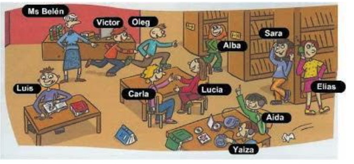

# Aula 06 - 30/05/2022

# **Pronomes Pessoais x Pronomes Objeto**

**PERSONAL** – Pronome pessoal só pode ser usado se estiver conjugando um verbo na frase.

**OBJECTIVE** –  Pronome objeto, possui a mesma tradução que o pronome pessoal, mas é usado quando não estiver conjugando um verbo.

| PERSONAL | OBJECTIVE  |
| --- | --- |
| I | ME |
| YOU  | YOU  |
| HE | HIM  |
| SHE  | HER  |
| IT  | IT  |
| WE  | US |
| YOU  | YOU  |
| THEY | THEM  |
- She took **him** to the train station in the morning
- Did you talk to **them** yesterday?
- We don´t have to visit **her** tomorrow
- I didn´t see **you** this afternoon
- They talked to **me** about **you**

## **ACTIVITY**

### 1 - **C**omplete with objective pronouns

1. Give **me** that book. I need it now.
2. I know **her**! She is Mark´s sister
3. Where was John yesterday? I didn´t see **him** all day long.
4. Carla and Regina are in my class, but I never see **them**.

## 2 - Substitua os sujeitos das frases pelos pronomes objetos que melhor se encaixam:

1. Kelly likes Bruno
    1. Kelly likes him
2. Tell Julia the News
    1. Tell her the News.
3. I visit my friends
    1. I visit them.
4. Bob doesn’t like dog
    1. Bob doesn’t like it.
5. She lives with John and Marco
    1. She lives with them.

## 3 - Complete as frases com o pronome adequado levando em consideração as dicas entre parênteses:

Can you call **me**? ( I )

I know **you.** ( you )

Paula calls **him** every night. ( John)

I don’t like **it.** ( cat )

Call **then** tomorrow. ( Julia and Clara )

## 4. - Listening

1. I don’t speak with her
2. I don’t want work with him
3. She speaks with me
4. Sometimes I read with you on wekeends.
5. Sometimes He reads with us.
6. Sometimes We don’t study with you.

# **Present Continuous**

Emprega – se este tempo verbal nas seguintes situações:

- Ações que estão acontecendo agora, neste momento, atualmente. É o que chamamos de gerúndio. Ex:
    - What are you doing now?
    - I am Studying now.
    
- Estrutura do Present **Continuous**:
    - Suj+ Verb to be (AM, ARE, IS) + verbo principal com ING + complemento
    
- Advérbios mais comuns nesse tipo de sentença: Now, at this moment, at present, today.
- Acrescentamos ING para a maioria dos verbos, sem afetar a ortografia.
- Quando o verbo termina em E, tiramos o E e acrescentamos o ING
    - Make/ making
    - Use/ using
    - Have/ having
- Quando os verbos forem= em CVC, dobra – se a última consoante
    - Run/running
    - Hit/hitting
- Quando os verbos terminam em IE, tirar o IE e acrescentar o YING
    - Lie/lying
    - Die/Dying

## 1 - Descreva a imagem

1. Luis is reading.
2. Carla and Lucia are speaking.
3. Yaiza and Ainda are listening music.
4. Victor and Oleg are running.
5. Sara and Elias are talking on phone.
6. Alba is searching a book.
7. Ms Belén is looking the childrens.

## 2 - Listening

1. Are you dancing now? - dançando
2. Chalie is writing on the wall. - escrevendo
3. Dexter, are you listening to me? - ouvindo
4. Yes, I’m listening. - ouvindo
5. I’m not bothering you, am I? - incomodando
6. I know what you’re doing - fazendo
7. Having breakfest - Tomando café da manhã
8. Merli, what are you doing? - fazendo
9. Looking for a book - procurando
10. Are you tweeting about me? - Twitando
11. Am I tweeting about you? Twitando
12. What are you talking about you? - falando
13. Someones’s gossiping online about me - fofocando
14. I know what you’re thinking - pensando
15. I’m not thinking anything - pensando em nada
16. What are you doing? - fazendo
17. I’m texting - digitando/teclando
18. What are you doing? - fazendo
19. What am I doing? - fazendo
20. Making an omelette. - fazendo
21. What are you studyng? - estudando
22. What are you two laughing at? - rindo
23. They are making a title sequence! - fazendo

## 3 - Monte as frases

a) They / not talk - They are not talking

b) She / not drink fruit juice - She´s not drinking fruit juice

c) I / not have dinner - I am not having dinner

d) you / not wear a jacket -You are not wearing a jacket

e) He / not play the piano - He is not playing the piano

f) Mary and Julia / not get up - Mary and Julia are not getting up

g) Theo and I / not sit in the garden - Theo and I are not sitting in the garden

h) It / not rain - It is not raining

i) You / not make dinner - You are not making dinner
