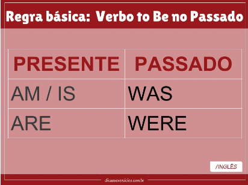
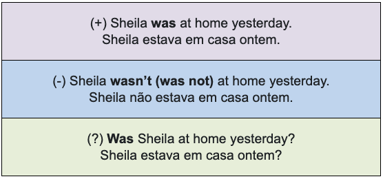

# Aula 10 - 04/07/2022

# VERB TO BE (SIMPLE PAST)

- I , he, she, it - was
- You, they, we - were
- were not – weren´t

## Pratices

1. **Complete as frases com: was/were ou wasn't/weren't.**
    1. - **Were** you at the party last night? - No, I **was** sick.
    2. The weather **was** great, but the hotel **wasn't**. It **was** too far from the city.
    3. - Where **were** Jack and Mike last night? - I think Jack **was** at home, but Mike **was** out.
    4. Last week we had lunch at the new restaurant. The service **wasn't** good, but the food **was** excellent.
    5. - Who was at the door? **Was** it Sarah?- No, it **wasn't** Sarah, it **was** her brother.
    6. - Tammy and Joanna **weren't** on time for the meeting this morning.- Yes, that's because the traffic **was** really awful.
    7. Melissa's hair **was** short last year. It's so long now!
    
2. Forme perguntas com was ou were. **Exemplo: you / at home yesterday? / Were you at home yesterday?**
    1. **where / you?**
        1. Where were you?
    2. **the museum / open?**
        1. Was the museum open?
    3. **Sam / with you?**
        1. Was Sam with you?
    4. **why / he / late?**
        1. Why was he late?
    5. **why /  the tickets / expensive?**
        1. Why were the tickets expensive?